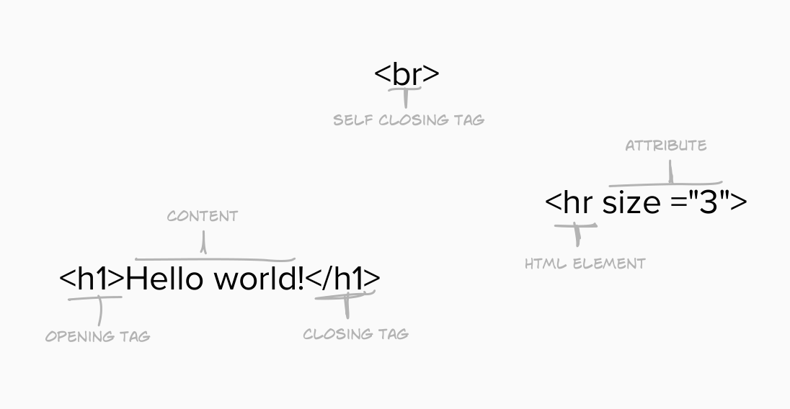

# The Anatomy of HTML

## Structuring a tag:

* `tags` make requests to the browser (sorta like the publisher), asking it what to display and how to structure it, so we get it looking the    way we want
* Not all tags have a closing tag (`
`). You can go on [devdocs.io](https://devdocs.io/) > **Desired Tag** > **Tag Omission** there you can see what tags don't need closing
* An example of the above, is the `
` horizontal line tag
* Use **HTML** attributes to specify tag modifications - You can see available attributes for each tag on [devdocs.io](https://devdocs.io/)